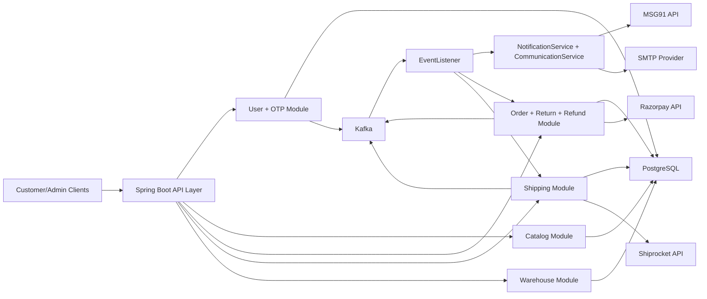

# High-Level Architecture

## 1) System Style
This service is a **modular Spring Boot monolith** with:
- synchronous REST APIs for core business operations,
- asynchronous Kafka events for cross-cutting workflows (shipping, notifications, refunds),
- PostgreSQL as the system of record,
- external provider integrations for payments, logistics, and communication.

## 2) Component View

## 3) Layered Structure
- **API Layer**: Controllers expose domain endpoints.
  - `/user` for registration, OTP, login, profile.
  - `/products` for catalog, variants, inventory, search.
  - `/api` for orders, returns, refunds, shipping status/history, warehouse.
  - `/api/payments` for payment verification callbacks.
  - `/api/shipping` for Shiprocket proxy operations.
- **Service Layer**: Business orchestration (`UserServiceImpl`, `OtpServiceImpl`, `ProductServiceImpl`, `OrderServiceImpl`, `ShippingServiceImpl`, `WarehouseServiceImpl`).
- **Persistence Layer**: Spring Data JPA repositories over PostgreSQL entities.
- **Integration Layer**: `RazorpayClient`, `RestTemplate` clients for Shiprocket and MSG91, plus SMTP fallback.
- **Event Layer**: Kafka producer/consumer templates and typed listeners for domain events.

## 4) Event-Driven Architecture
Kafka topics used:
- `customer-events`: notification events (OTP, order/refund communication).
- `order-events`: order lifecycle events (`ORDER_SHIPPED`, `ORDER_CANCELLED`, `ORDER_RETURN_REQUESTED`).
- `refund-events`: refund initiation events.

Consumers:
- `EventListener` routes events to `NotificationService`, `ShippingService`, and `OrderService`.

## 5) Core Business Flows
### A) Order to Shipment
1. `POST /api/orders` creates customer/order/address/items, reserves inventory, creates Razorpay order metadata.
2. `POST /api/payments/verify` validates signature and updates payment status.
3. `ORDER_SHIPPED` event is published.
4. `ShippingServiceImpl.processCreateShipmentEvent` creates shipment records and calls Shiprocket (order, AWB, pickup, label).

### B) Cancellation to Refund
1. `POST /api/order-cancel` registers cancellation and publishes `ORDER_CANCELLED`.
2. Cancellation processor restores inventory and creates refund transaction state.
3. Refund communication is published to `customer-events`.

### C) Return to Reverse Logistics to Refund
1. Return request/approval updates order state and publishes `ORDER_RETURN_REQUESTED`.
2. Return processor creates reverse shipment (`RETURN_PICKUP`) and tracking history.
3. Shipment status updates can trigger `RefundInitiatedEvent` on `refund-events` when return is received.
4. Refund processor calls Razorpay refund API and publishes customer communication updates.

## 6) Deployment View
- Containerized runtime via `Dockerfile` + `docker-compose.yml`.
- Main services: `app` (Spring Boot), `db` (PostgreSQL), `kafka` + `zookeeper`, and `kafdrop`.
- File volumes support category/return image storage (`/public`) and application logs (`/app/logs`).
- CORS currently allows `http://localhost:3000` for frontend integration.

## 7) Architectural Strengths
- Clear module separation inside one deployable service.
- Strong use of events for long-running and cross-domain operations.
- Provider integrations isolated behind service classes.
- Good fit for incremental extraction into microservices if needed later.

## 8) Suggested Evolution (Optional)
- Add an API gateway/BFF layer when multiple client apps grow.
- Move secrets to environment/secret manager only.
- Add outbox + idempotency handling for guaranteed event delivery.
- Add centralized tracing (OpenTelemetry) for end-to-end flow visibility.
