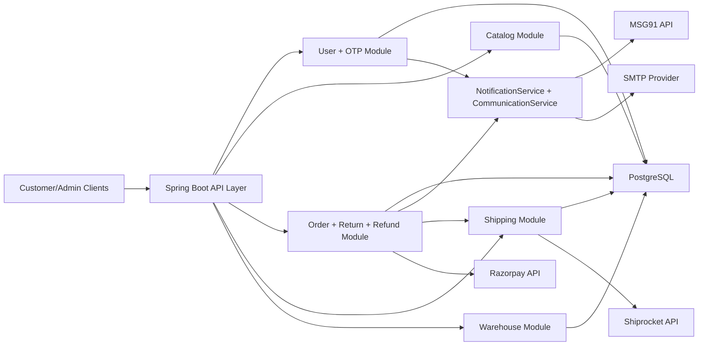

# High-Level Architecture

## 1) System Style
This service is a **modular Spring Boot monolith** with:
- synchronous REST APIs for core business operations,
- direct in-process method calls for cross-cutting workflows (shipping, notifications, refunds),
- PostgreSQL as the system of record,
- external provider integrations for payments, logistics, and communication.

## 2) Component View

```mermaid
flowchart LR
    UI["Customer/Admin Clients"] --> API["Spring Boot API Layer"]

    API --> USER["User + OTP Module"]
    API --> CATALOG["Catalog Module"]
    API --> ORDER["Order + Return + Refund Module"]
    API --> SHIP["Shipping Module"]
    API --> WH["Warehouse Module"]

    USER --> DB["PostgreSQL"]
    CATALOG --> DB
    ORDER --> DB
    SHIP --> DB
    WH --> DB

    ORDER --> NOTIFY["NotificationService + CommunicationService"]
    USER --> NOTIFY
    ORDER --> SHIP

    ORDER --> RAZORPAY["Razorpay API"]
    SHIP --> SHIPROCKET["Shiprocket API"]
    NOTIFY --> MSG91["MSG91 API"]
    NOTIFY --> SMTP["SMTP Provider"]
```

## 3) Layered Structure
- **API Layer**: Controllers expose domain endpoints.
  - `/user` for registration, OTP, login, profile.
  - `/products` for catalog, variants, inventory, search.
  - `/api` for orders, returns, refunds, shipping status/history, warehouse.
  - `/api/payments` for payment verification callbacks.
  - `/api/shipping` for Shiprocket proxy operations.
- **Service Layer**: Business orchestration (`UserServiceImpl`, `OtpServiceImpl`, `ProductServiceImpl`, `OrderServiceImpl`, `ShippingServiceImpl`, `WarehouseServiceImpl`).
- **Persistence Layer**: Spring Data JPA repositories over PostgreSQL entities.
- **Integration Layer**: `RazorpayClient`, `RestTemplate` clients for Shiprocket and MSG91, plus SMTP fallback.
- **Event Layer**: Typed event DTOs (`Event`, `OrderEvent`, `RefundInitiatedEvent`, `ShiprocketOrderEvent`) are passed directly between services via method calls (no external message broker).

## 4) Event-Driven Workflows (In-Process)
Domain events (still modeled as typed DTOs, but dispatched synchronously/directly rather than via a broker):
- Notification events (OTP, order/refund communication) handled by `NotificationService`/`CommunicationService`.
- Order lifecycle events (`ORDER_SHIPPED`, `ORDER_CANCELLED`, `ORDER_RETURN_REQUESTED`) handled by `OrderService`/`ShippingService`.
- Refund initiation events handled by the refund processing flow.

Routing:
- `EventListener` (kept as a lightweight placeholder) and service classes route events directly to `NotificationService`, `ShippingService`, and `OrderService` via method calls.

## 5) Core Business Flows
### A) Order to Shipment
1. `POST /api/orders` creates customer/order/address/items, reserves inventory, creates Razorpay order metadata.
2. `POST /api/payments/verify` validates signature and updates payment status.
3. An `ORDER_SHIPPED` event is dispatched directly (in-process).
4. `ShippingServiceImpl.processCreateShipmentEvent` creates shipment records and calls Shiprocket (order, AWB, pickup, label).

### B) Cancellation to Refund
1. `POST /api/order-cancel` registers cancellation and dispatches `ORDER_CANCELLED` in-process.
2. Cancellation processor restores inventory and creates refund transaction state.
3. Refund communication is sent directly to the notification flow.

### C) Return to Reverse Logistics to Refund
1. Return request/approval updates order state and dispatches `ORDER_RETURN_REQUESTED` in-process.
2. Return processor creates reverse shipment (`RETURN_PICKUP`) and tracking history.
3. Shipment status updates can trigger a `RefundInitiatedEvent` handled directly when a return is received.
4. Refund processor calls Razorpay refund API and triggers customer communication updates.

## 6) Deployment View
- Containerized runtime via `Dockerfile` + `docker-compose.yml`.
- Main services: `app` (Spring Boot) and `db` (PostgreSQL).
- File volumes support category/return image storage (`/public`) and application logs (`/app/logs`).
- CORS currently allows `http://localhost:3000` for frontend integration.

## 7) Architectural Strengths
- Clear module separation inside one deployable service.
- Simple, synchronous event dispatch avoids the operational overhead of a message broker.
- Provider integrations isolated behind service classes.
- Good fit for incremental extraction into microservices if needed later (a message broker can be reintroduced at that point).

## 8) Suggested Evolution (Optional)
- Add an API gateway/BFF layer when multiple client apps grow.
- Move secrets to environment/secret manager only.
- Reintroduce a message broker (e.g., Kafka) with outbox + idempotency handling only if/when async, cross-service event delivery is actually required.
- Add centralized tracing (OpenTelemetry) for end-to-end flow visibility.
