# Order Creation Flow (existing implementation)

Source: `OrderServiceImpl.createOrder(OrderCreateDTO)` — called by `POST /api/order` (`OrderController.createOrder`).

## Flow Diagram

```mermaid
flowchart TD
    A["POST /api/order\nOrderController.createOrder(OrderCreateDTO)"] --> B["OrderServiceImpl.createOrder()"]
    B --> C{"customerId provided\nAND found in DB?"}

    C -- "Yes" --> F1["Use existing CustomerEO"]
    C -- "No" --> D{"userId provided\nAND UserEO found?"}

    D -- "Yes" --> D1["Link existing UserEO to new CustomerEO\ncustomerType = REGISTERED"]
    D -- "No" --> E{"phone provided?"}

    E -- "No" --> E1["FAILURE:\nPHONE_NO_MISSING_CUST_USER\n(return early)"]
    E -- "Yes" --> E2["Create new UserEO\n(role=USER, phone, name, email, ACTIVE)\nsave UserEO"]
    E2 --> E3["Create new CustomerEO\ncustomerType = GUEST\nlink savedUser\nsave CustomerEO"]

    D1 --> F2["Persist CustomerEO\n(status ACTIVE)"]
    E3 --> F2
    F1 --> G

    F2 --> G["Step 2: Calculate subtotal\nFor each requested product:\n  fetch ProductVariantEO\n  subtotal += sellingPrice * qty"]

    G --> H["Look up matching DeliveryChargeEO rule\nfor subtotal"]
    H --> H1{"Rule found?"}
    H1 -- "Yes" --> H2["shippingFee = rule.deliveryCharge\nisFreeDelivery = rule.isFreeDelivery"]
    H1 -- "No" --> H3["shippingFee = 0 (default)"]
    H2 --> I
    H3 --> I["grandTotal = subtotal + shippingFee"]

    I --> J["Step 2b: Create & save OrderEO\norderNumber (generated)\nstatus = CREATED (or provided)\npaymentStatus = PENDING\ncurrency, subtotal, shippingFee,\ntax=0, discount=0, totalAmount=grandTotal"]

    J --> K{"orderAddressId provided\nAND CustomerAddressEO found?"}
    K -- "Yes" --> K1["Reuse existing CustomerAddressEO\nCopy fields into new OrderAddressEO"]
    K -- "No" --> K2["Create new CustomerAddressEO\nfrom inline address fields\n(name/address1/2/city/state/\nlandmark/postal/country/phone)\nsave CustomerAddressEO"]
    K2 --> K3["Copy fields into new OrderAddressEO"]
    K1 --> L
    K3 --> L["Save OrderAddressEO\n(linked to savedOrder)"]

    L --> M["Step 4: For each product line:\nfetch ProductVariantEO\ncreate OrderItemEO\n(sku, name, qty, unitPrice,\ntotalPrice = unitPrice * qty)"]
    M --> N["Save all OrderItemEO (saveAll)"]

    N --> O["Build Razorpay order request\namount = totalAmount * 100 (paise)\ncurrency = INR\nreceipt = order_rcptid_<timestamp>\npayment_capture = 1\nnotes: subtotal, shipping_fee, order_number"]
    O --> P["razorpayClient.orders.create(orderRequest)\n=> payOrder (Razorpay order id, amount)"]

    P --> Q["Create & save PaymentEO\npaymentStatus = CREATED\npaymentProvider = RAZORPAY\npaymentProviderOrderId = payOrder.id\namount = payOrder.amount / 100"]

    Q --> R["Step: Update Inventory\nFor each saved OrderItemEO:\n  find InventoryEO by ProductVariant\n  availableQty -= qty\n  totalQty = max(0, totalQty - qty)\n  save InventoryEO"]

    R --> S["Build OrderResponseDTO:\norderNumber, paymentOrderId,\nsubtotalAmount, shippingFee, isFreeDelivery,\namount (grandTotal), currency, storeName,\ndescription, paymentGatewayKey (Razorpay key id),\nmessage = ORDER_CREATED_SUCCESS\nstatus = SUCCESS"]

    S --> T(["Return 200 OK\nOrderResponseDTO"])

    B -.->|"any Exception thrown\nat any step above"| X["catch (Exception e)\nlog error\nresponseDTO.message = ORDER_CREATED_FAILURE\nresponseDTO.status = FAILURE_STATUS"]
    X --> Y(["Return OrderResponseDTO\n(failure)"])
```

## Step-by-step summary

1. **Resolve/create Customer**
   - If `customerId` is supplied and resolves to an existing `CustomerEO`, reuse it.
   - Otherwise, try to link an existing `UserEO` (via `userId`) as a *registered* customer.
   - If no user found, require `phone` (fails with `PHONE_NO_MISSING_CUST_USER` if missing), then create a brand-new `UserEO` (role `USER`, status `ACTIVE`) and a *guest* `CustomerEO` linked to it.
   - Persist the `CustomerEO` (status `ACTIVE`).

2. **Server-side pricing**
   - Recompute `subtotalAmount` from each product variant's current `sellingPrice × quantity` (client-submitted totals are ignored for trust/security).
   - Look up the first matching `DeliveryChargeEO` rule for the subtotal to determine `shippingFee` / free-delivery flag; defaults to `0` if no rule matches.
   - `grandTotal = subtotal + shippingFee`.

3. **Create the Order**
   - New `OrderEO` linked to the customer; `orderNumber` generated via `OrderNumberService`; initial `orderStatus = CREATED` (or client-supplied), `paymentStatus = PENDING`, currency, computed amounts (tax/discount hardcoded to `0` at creation time).

4. **Order Address**
   - If a `orderAddressId` was passed and resolves to a saved `CustomerAddressEO`, its fields are copied into a new `OrderAddressEO` snapshot.
   - Otherwise, a new `CustomerAddressEO` is created/persisted from the inline address fields in the request, then copied into the `OrderAddressEO` snapshot the same way.
   - The `OrderAddressEO` is always a **new row per order** (a point-in-time copy), not a reference to the customer's reusable address.

5. **Order Items**
   - For every requested product, fetch the `ProductVariantEO`, create an `OrderItemEO` (sku, name, qty, unit/total price), and bulk-save all items.

6. **Razorpay Payment Order**
   - Build a Razorpay order-create request with `amount` in paise, `currency=INR`, a generated receipt id, `payment_capture=1`, and notes carrying the subtotal/shipping/order-number breakdown.
   - Call Razorpay to create the payment order.
   - Persist a `PaymentEO` row (`status=CREATED`, provider=`RAZORPAY`, `paymentProviderOrderId`, `amount` from Razorpay's response).

7. **Inventory Deduction**
   - For each order item, decrement the matching `InventoryEO.availableQty` and `totalQty` (floored at 0) **at order-creation time** (not at payment-confirmation time).

8. **Response**
   - Returns an `OrderResponseDTO` with order number, Razorpay payment order id, amounts, free-delivery flag, currency, store name/description, and the Razorpay public key (`paymentGatewayKey`) needed by the client to open the checkout widget.
   - Any exception anywhere in the above steps is caught, logged, and converted into a `FAILURE_STATUS` response (no explicit rollback/compensation logic is shown in this method — see note below).

## Notable characteristics / risks (as currently implemented)

- **No `@Transactional` annotation** on `createOrder` — if a later step (e.g. Razorpay API call or inventory update) fails, earlier DB writes (customer, order, address, order items) are **not rolled back automatically**, only a Spring-managed transaction would ensure atomicity here.
- **Inventory is decremented immediately at order creation**, before payment is confirmed — this can oversell if the customer abandons checkout, unless a separate expiry/cleanup job reverses it.
- **Guest customer/user creation** happens inline within the same method when no existing customer/user is found.
- **Pricing is always recalculated server-side** from live `ProductVariantEO.sellingPrice`, ignoring any amounts sent by the client.
- **Shipment/Shiprocket creation is not part of this flow** — it is triggered later, typically after payment confirmation (see `updateOrderPaymentStatus` → `shippingService.processCreateShipmentEvent`).

